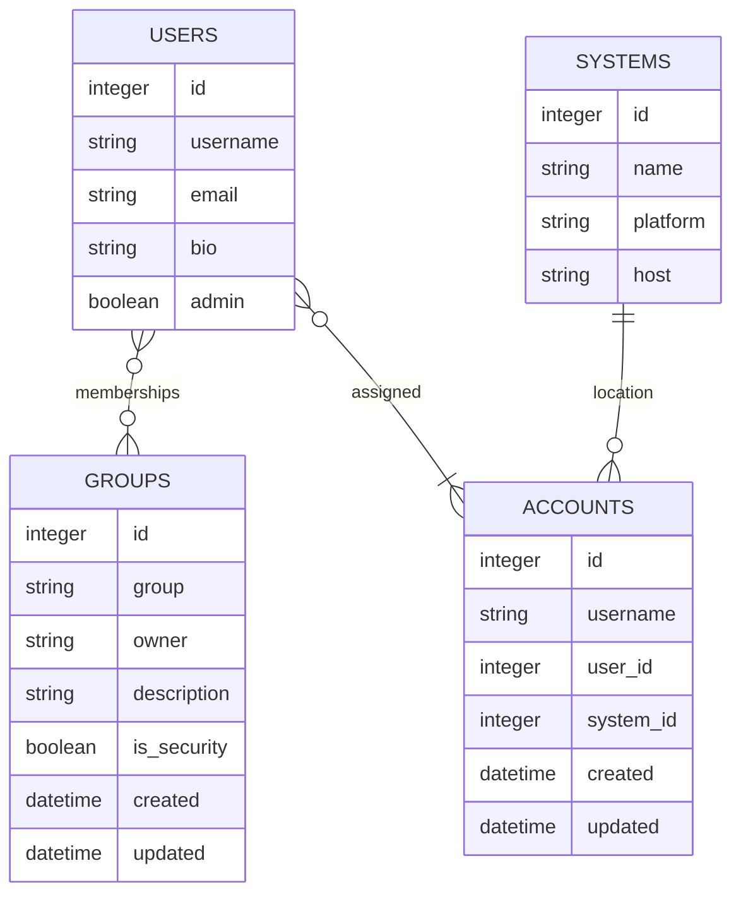
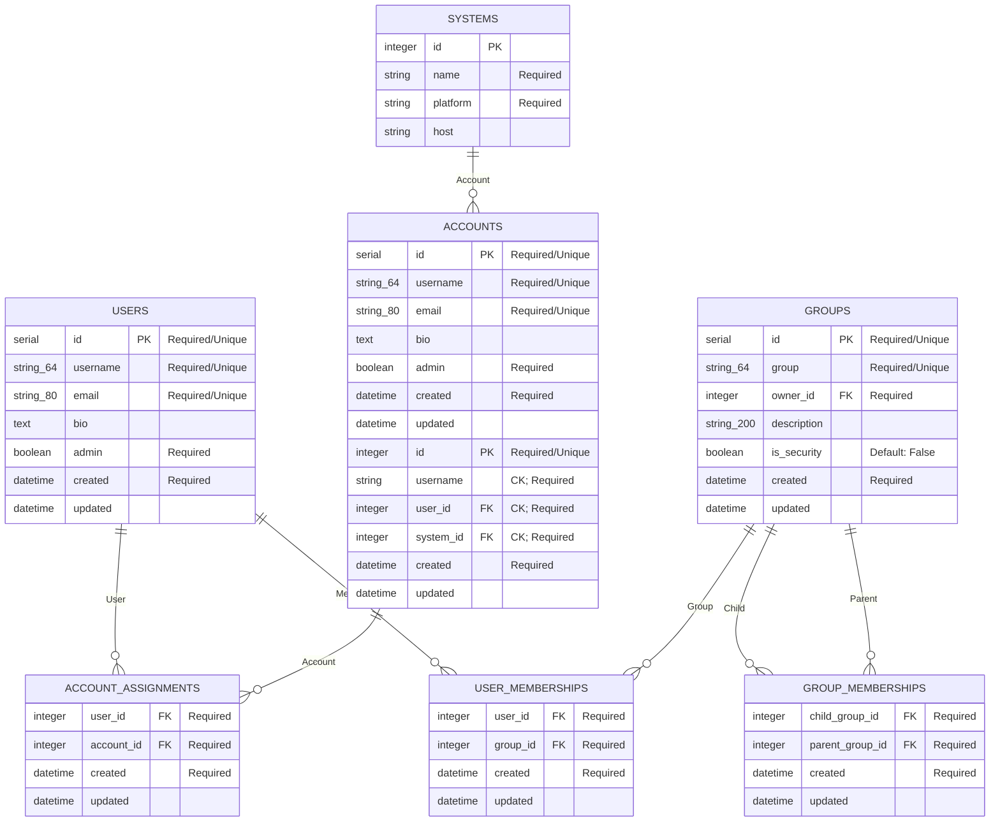

# Database

Included are 

[[__TOC__]]

## Cheatsheet

Display database comands
```bash
flask db --help
```


## Setup & Configuration
Flask-Migrate (Alembic) is used for database updates, tracking model changes, autogenerating migration files, and applying those files to the database.

### Initialize migration database (run once)

```bash
flask db init
```

- <small>Creates the `migrations/` directory</small>
- <small>Update logging settings in `migrations/alembic.ini`</small>
- <small>Update the _online_ options of `/migrations/env.py` to rename `alembic_versions` table in the database.      
    To track migrations in `app.migrations` schema.table add the following options to **env.py#context.Configure()** before running `flask db migrate`:
   ```python
   version_table='migrations',
   version_table_schema='app',
   include_shemas=True
   ```
   </small>
   `include_schemas` should be used when using a database schema other than `public` so Alembic will search those schemas for this existing table
<!--
- <small></small>
-->


### Generate a Migration File

```bash
flask db migrate -m"Initial migration"
```

- <small>Adds file to `migrations/versions/` directory</small>
- <small>Not supplying the `-m` tag will still generate a migration file.  The file will only contain a timestamp and no meaningful message</small>
- <small>**Note:** review the file; not every change is detected (e.g., table name changes, column name changes, constraints, etc). Refer to [Alembic's autogenerate documentation](http://alembic.zzzcomputing.com/en/latest/autogenerate.html#what-does-autogenerate-detect-and-what-does-it-not-detect) for a summary of limitations.</small>
<!--
- <small></small>
-->

### Stamping the Migration File

```bash
flask db stamp head
```
- <small>This marks the database as current and is used when changes have already been applied (manually) or migration log table is out-of-sync or  not updated.</small>
- <small>`head` is used to point to the most recent, if the database is in an older state, stamp to that version number instead</small>
- <small>**Note**: Only necessary when database is already up to date.</small>
<!--
- <small></small>
-->


### Run the migration (update the database)

```bash
flask db upgrade 
# reverse: flask db downgrade
```

## Database Schema


### Simple
A basic understanding of the key parts of the system.  This aims to be a first-look, high-level look to build a conceptual understanding. For instance, it depicts that users are assigned one or more account.  In reality, there would be another bridge table to track when they were assigned the account to track the assignment.  The simple diagram places some of the nouns and some fundamental associations; for a more accurate portrayal of the database design see the complex version.



### Complex
A more complex depiction of the system as more closely resembles reality.  While it may not contain all metadata, constraints, and associations; the code should mostly resemble this chart.  For a simpler depiction of the system (tracking nouns at a higher level), refer to the the simple diagram above.

